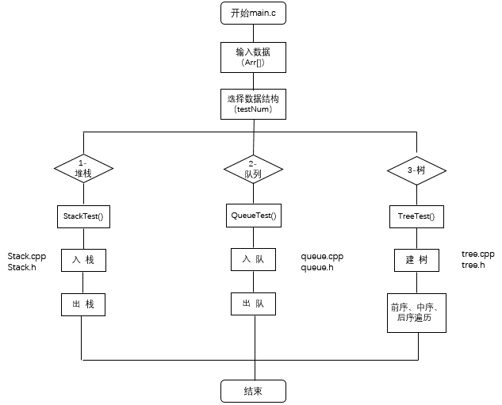
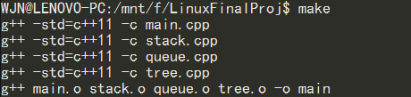
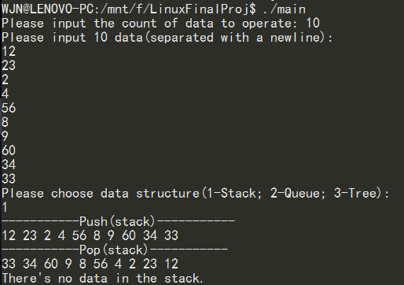
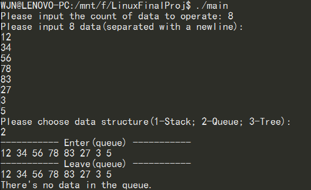
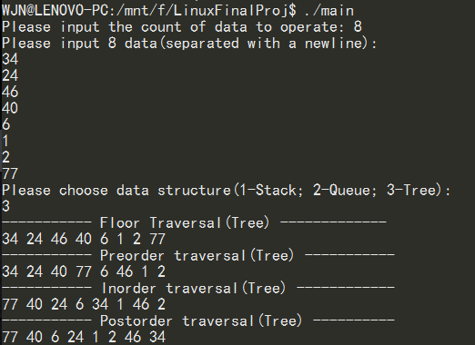

# Linux Final Project Report
>姓名：王建男
>
>学号：22920142203919

### 一、实验目的与要求
编写一个队列、栈、树等数据结构操作的软件库。 要求：
 1. 软件库的定义和实现文件要分开。注意：.h 文件里是要公开供用户调用的定义，.c 文件里的是要封装起来不被人看到的。 
 2. 写一个主程序去调用这些数据结构的操作，验证软件库的正确性。 
 3. 项目包括 Makefile，通过 make 命令可以自动构建整个库。 
 4. 最终项目发布到GitHub上，作业内容是提交仓库地址。

### 二、项目结构与流程


> Fig.1 项目结构与流程

主函数是程序入口，根据输入的testNum选择数据结构，然后利用选择的数据结构做相应的操作：
* 堆栈：将输入数据按顺序入栈，然后依次出栈
* 队列：将输入数据按顺序入队，然后依次出队
* 二叉树：将输入的数据先建立完全二叉树，然后依次进行前序、中序和后序遍历

### 三、项目运行结果
（注：由于学校CS8服务器近期无法正常登录使用，所以截图来源于Win10自带的Ubuntu Bash这一实验环境。）

1. make


> Fig.2 make


2. 堆栈（先入后出）


> Fig.3 stack


3. 队列（先入先出）


> Fig.4 queue


4. 二叉树


> Fig.5 tree


### 四、主要程序
1. Makefile
```C++
main:main.o stack.o queue.o tree.o
    g++ main.o stack.o queue.o tree.o -o main

main.o:main.cpp include/stack.h include/queue.h include/tree.h
    g++ -std=c++11 -c main.cpp

stack.o:stack.cpp include/stack.h
    g++ -std=c++11 -c stack.cpp

queue.o:queue.cpp include/queue.h
    g++ -std=c++11 -c queue.cpp

tree.o:tree.cpp include/tree.h include/queue.h
    g++ -std=c++11 -c tree.cpp

clean:
    rm main *.o
```


2. 主函数
```C++
int main()
{
    int testNum;
    int count, i;
    printf("Please input the count of data to operate: ");
    scanf("%d", &count);
    printf("Please input %d data(separated with a newline):\n", count);
    for(i = 0; i < count; i++){
        scanf("%d", &Arr[i]);
    }

    printf("Please choose data structure(1-Stack; 2-Queue; 3-Tree):\n");
    scanf("%d", &testNum);  
    while(testNum != 1 and testNum != 2 and testNum != 3){
        printf("testNumber is wrong! Please input again!\n");
        scanf("%d", &testNum);
    }

    switch(testNum){
        case 1: StackTest(count);break;
        case 2: QueueTest(count);break;
        case 3: TreeTest(count);break;
    }

    return 0;
}
```
主函数是程序入口，在主函数中又分别定义了三个子函数StackTest()、QueueTest()、TreeTest()，用于执行对各类数据结构的操作。
具体定义：
```C++
void StackTest(int count){
    Stack *stack = new Stack();
    int data;
    int i;

    printf("-----------Push(stack)-----------\n");
    for(i = 0; i < count; i++){
        stack->Push(Arr[i]);
        printf("%d ", Arr[i]);
    }
    printf("\n");
    
    printf("-----------Pop(stack)-----------\n");
    for(i = 0; i < count; i++){
        data = stack->Pop();
        printf("%d ", data);
    }
    printf("\n");

    stack->Clear();
    //printf("%d\n", stack->getSize());
    data = stack->Pop();
    //printf("%d,%d\n\n", stack->getSize(), data);
}

void QueueTest(int count){
    Queue *queue = new Queue();
    int data2;
    int i;
    
    printf("----------- Enter(queue) -----------\n");
    for(i = 0; i < count; i++){
        queue->EnQueue(Arr[i]);
        printf("%d ", Arr[i]);
    }
    printf("\n");

    printf("----------- Leave(queue) -----------\n");
    for(i = 0; i < count; i++){
        int data2 =queue->DeQueue();
        printf("%d ", data2);
    }
    printf("\n");
    queue->Clear();
    data2 = queue->DeQueue();
}


void TreeTest(int count){
    Twotree *twotree = new Twotree();
    int i;
    twotree->createNode(Arr[0]);

    for(i = 1; i < count; i++)
        twotree->add(twotree->getRoot(),Arr[i]);
    //printf("%d\n",twotree->getSize());
    twotree->floorOrder();

    printf("----------- Preorder traversal(Tree) -----------\n");
    twotree->PreOrder(twotree->getRoot());
    printf("\n");
    printf("----------- Inorder traversal(Tree) ------------\n");
    twotree->InOrder(twotree->getRoot());
    printf("\n");
    printf("----------- Postorder traversal(Tree) ----------\n");
    twotree->PostOrder(twotree->getRoot());
    printf("\n");
}
```


3. 堆栈
堆栈的主要类的定义如下（stack.h）：
```C++
typedef struct sData
{
    int data;
    sData *next;
}StackData;

class Stack
{
public:
    Stack();
    ~Stack();
    void Push(int data); //入栈
    int Pop(); //出栈
    void CreateNode(int data);
    void Clear(); //清空栈
    int getSize();//获取栈内元素个数

private:
    StackData * pop;
    int size;
};
```
各个类的具体实现如下（stack.cpp）：
```C++
void Stack::CreateNode(int data){
    StackData *p = new StackData;
    if (p == nullptr){
        printf("Node creation failure!\n");
        return;
    }
    pop = p;
    p->data = data;
    pop->next = nullptr;
    size++;
}


void Stack::Push(int data){
    StackData * p = pop;
    if (pop == nullptr)
        CreateNode(data);
    else{
        CreateNode(data);
        pop->next = p;
    }
}


int Stack::getSize()
{
    return size;
}


int Stack::Pop()
{
    StackData *p = pop;
    if (pop == nullptr){
        printf("There's no data in the stack.\n");
        return -10000;
    }

    else{
        pop = pop->next;
        int data = p->data;
        delete p;
        size--;     
        return data;
    }
}


void Stack::Clear()
{
    while(pop!= nullptr){
        StackData* p = pop;
        pop = pop->next;
        size--;
        delete p;
    }
}

Stack::Stack()
{
    pop = nullptr;
    size = 0;
}
```


4. 队列
队列主要类的定义如下（queue.h）:
```C++
class Queue
{
public:
    Queue();
    ~Queue();  
    void EnQueue(int data);  //入队
    int  DeQueue();  //出队
    bool IsQueueEmpty();  //判断是否为空
    int getSize();  //获取队内元素个数
    void Clear();  //清空队列

private:
    int size;
    QueueData *pop;
};
```
各个类的具体实现如下（queue.cpp）:
```C++
void Queue::EnQueue(int data)
{
    if (pop == nullptr){
        QueueData* p = new QueueData;
        if (p == nullptr){
            printf("Node creation failure!\n");
            return;
        }
        pop = p;
        pop->data = data;
        size++;
        pop->next = nullptr;
    }
    else{
        //需要先判断是否它的下个结点是为空
        QueueData* temp = pop;
        while (temp->next != nullptr){
            temp = temp->next;
        }
        temp->next = new QueueData;
        if (temp == nullptr){
            printf("Node creation failure!\n");
            return;
        }       
        temp->next->data = data;
        size++;
        temp->next->next = nullptr;
    }
}

void Queue::Clear()
{
    while (pop != nullptr)
    {
        size--;
        QueueData * p = pop;
        pop = pop->next;
        delete p;
    }
}

int Queue::DeQueue()
{
    if (pop != nullptr){
        size--;
        QueueData * p = pop;
        int data = pop->data;
        pop = pop->next;
        delete p;
        return data;
    }
    else{
        printf("There's no data in the queue.\n");
        return -10000000;
    }

}

int Queue::getSize(){
    return size;
}

bool Queue::IsQueueEmpty(){
    if (size == 0)
        return true;
    else
        return false;
}

Queue::Queue()
{
    pop = nullptr;
    size = 0;
}
```


5. 二叉树
二叉树主要类的定义如下（tree.h）:
```C++
typedef struct tree
{
    int data;
    tree * right;
    tree * left;
}Tree;

class Twotree
{
public:
    void createNode(int data);
    void add(Tree * T,int data); //添加节点

    void PreOrder(Tree *t); //前序遍历，从根结点开始：根->左->右
    void InOrder(Tree *t);  //中序遍历，从左结点开始：左->根->右
    void PostOrder(Tree *t);//后序遍历，从左结点开始：左->右->根
    void floorOrder(); //通过队列来逐层遍历
    Tree *getRoot();   //获得根结点
    int getSize();     //获得元素个数
    Twotree();
    ~Twotree();

private:
    Tree * root;
    int size;
    Queue *queue;
};
```
各个类的具体实现（tree.cpp），树的遍历用递归实现:
```C++
Tree* Twotree::getRoot()
{
    return this->root;
}

void Twotree::createNode(int data){
    if (root == nullptr){
        root = new Tree;
        if (root == nullptr)
        {
            printf("Fail to create node!\n");
            return;
        }
        queue->EnQueue(data);
        size++;
        root->data = data;
        root->left = nullptr;
        root->right = nullptr;
    }
}

void Twotree::add(Tree * T, int data){
    //如果左子树为空，则添加左子树
    if (T->left == nullptr){
        Tree *temp = new Tree;
        if (temp == nullptr){
            printf("Fail to create node!\n");
        }
        queue->EnQueue(data);
        T->left = temp;
        T->left->data = data;
        size++;
        T->left->left = nullptr;
        T->left->right = nullptr;
        return;
    }
    else if (T->right == nullptr){
        Tree *temp = new Tree;
        if (temp == nullptr){
            printf("Fail to create node!\n");
        }
        queue->EnQueue(data);
        T->right = temp;
        T->right->data = data;
        T->right->left = nullptr;
        T->right->right = nullptr;
        size++;
        return;
    }
    //如果右子树不为空，并且下个节点的左子树或者右子树为空，则需要建立下个节点左子树或者右子树。
    //如果左右子树的下个结点都完成了分配，那么就需要从左子树开始
    else if ((T->right != nullptr && (T->left->left == nullptr || T->left->right == nullptr)) || (T->right != nullptr&&T->right->left!= nullptr&&T->right->right != nullptr)){
        add(T->left, data);
        return;
    }
    else {
        add(T->right, data);
        return;
    }
}

void Twotree::PreOrder(Tree *t){
    if (t == nullptr){
        return;
    }
    //从根结点开始：根->左->右
    printf("%d ", t->data);
    PreOrder(t->left);
    PreOrder(t->right);
    return;
}
void Twotree::InOrder(Tree *t){
    if (t != nullptr){
        InOrder(t->left);
        //从左结点开始：左->根->右
        printf("%d ", t->data);
        InOrder(t->right);
    }
}
void Twotree::PostOrder(Tree *t){
    if (t != nullptr){
        PostOrder(t->left);
        PostOrder(t->right);
        //从左结点开始：左->右->根
        printf("%d ", t->data);
    }
}

int Twotree::getSize(){
    return this->size;
}

void Twotree::floorOrder(){
    printf("----------- Floor Traversal(Tree) -------------\n");
    for (int i = 0; i < this->size;i++)
    {
        int data = queue->DeQueue();
        printf("%d ", data);
    }
    printf("\n");
}

Twotree::Twotree()
{
    queue = new Queue();
    size = 0;
    root = nullptr;
}
```

### 五、遇到的问题
1. 在Makefile的编写时遇到问题，主要原因是没有仔细弄清楚各部分的依赖关系，容易遗漏。
2. 在编译过程中出现关于指针问题的报错，最后在Stack Overflow上找到相应的解决办法。因为是使用C++编写，所以在编译时需要加上参数-std=c++11。
3. 算法的选择，比如实现二叉树的遍历时，是使用递归方法还是非递归方法。
4. 在对各类数据结构各个类的具体实现过程中，都或多或少因为思考不够全面而出现问题，最后都一一完善解决。
